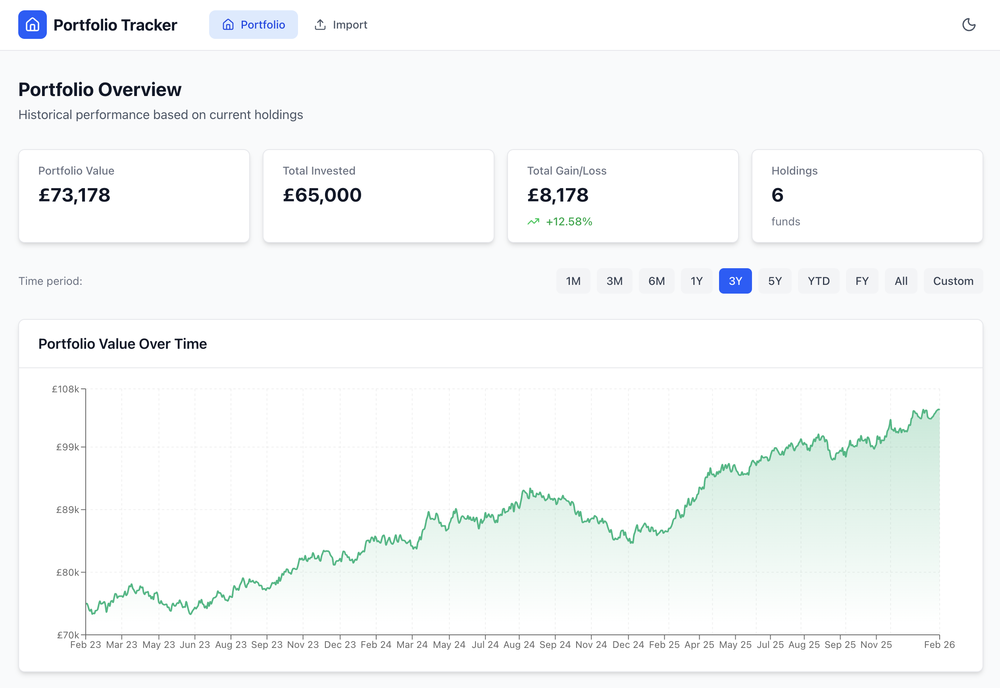
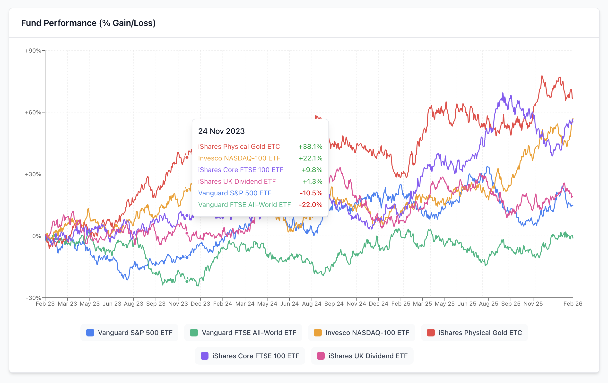
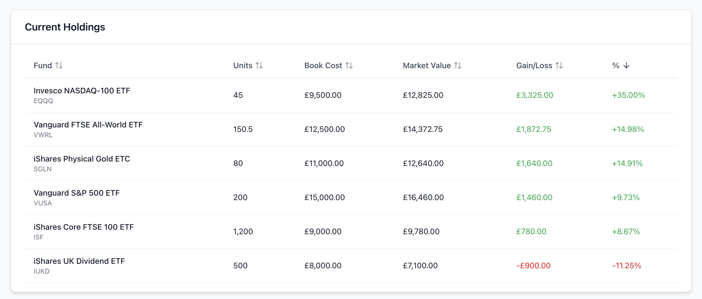
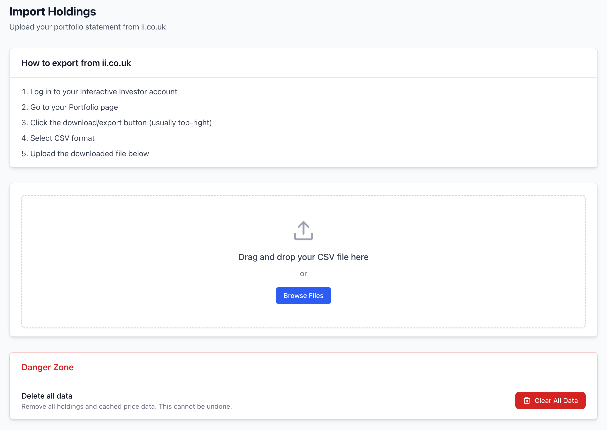

# ii Portfolio Dashboard

A portfolio tracking dashboard for Interactive Investor (ii.co.uk) accounts. Import your holdings from ii.co.uk CSV exports and visualize your portfolio performance over time.

## Features

- **CSV Import**: Import holdings directly from ii.co.uk portfolio exports
- **Historical Price Data**: Fetches up to 15 years of historical prices from Yahoo Finance (ETFs) and Morningstar (UK OEICs/funds)
- **Portfolio Value Chart**: Track your total portfolio value over time with dynamic Y-axis scaling
- **Fund Performance Chart**: Compare individual fund performance with percentage gain/loss
  - Click legend items to show/hide individual funds
  - Tooltip sorted by highest performers
- **Interactive Date Filtering**: 1M, 3M, 6M, 1Y, 3Y, 5Y, YTD, FY, All, or custom date range
- **Holdings Table**: View all holdings sorted by gain/loss percentage
- **Price Caching**: SQLite database caches prices for fast subsequent loads
- **Dark Mode Support**: Automatic dark mode based on system preferences

## Screenshots

### Portfolio Overview


### Fund Performance Comparison


### Holdings Table


### Import Page


## Tech Stack

- **Framework**: Next.js 15 (App Router)
- **Language**: TypeScript
- **Styling**: Tailwind CSS
- **Charts**: Recharts
- **Tables**: TanStack Table
- **Database**: SQLite (better-sqlite3)
- **Data Sources**: Yahoo Finance API, Morningstar UK API

## Getting Started

### Prerequisites

- Node.js 18+
- npm or yarn

### Installation

```bash
# Clone the repository
git clone https://github.com/YOUR_USERNAME/ii-portfolio-dashboard.git
cd ii-portfolio-dashboard

# Install dependencies
npm install

# Run the development server
npm run dev
```

Open [http://localhost:3000](http://localhost:3000) in your browser.

### Importing Your Portfolio

1. Log in to your Interactive Investor account
2. Go to your Portfolio page
3. Click the download/export button and select CSV format
4. In the dashboard, go to the Import page
5. Upload your CSV file

## Data Sources

- **ETFs** (e.g., IWRD, SMT, IJPH): Prices fetched from Yahoo Finance
- **UK OEICs/Unit Trusts**: Prices fetched from Morningstar UK API

Historical data is cached locally in SQLite to minimize API calls. On first load, fetching 15 years of history for all funds may take a minute.

## Project Structure

```
src/
├── app/
│   ├── api/           # API routes (portfolio-history, import, clear-data)
│   ├── funds/         # Individual fund detail pages
│   ├── import/        # CSV import page
│   └── page.tsx       # Main dashboard
├── components/
│   ├── charts/        # Portfolio and fund performance charts
│   ├── tables/        # Holdings table
│   └── ui/            # Reusable UI components (cards, buttons, date filter)
├── lib/
│   ├── csv-parser.ts       # ii.co.uk CSV parsing
│   ├── db.ts               # SQLite database operations
│   ├── price-fetcher.ts    # Yahoo Finance price fetching
│   └── morningstar-fetcher.ts  # Morningstar API integration
└── types/             # TypeScript type definitions
```

## Data Storage

All data is stored locally in a SQLite database at `data/portfolio.db`. No data is sent to external servers except for fetching prices from Yahoo Finance and Morningstar.

## Troubleshooting

### Prices not showing for some funds

UK OEICs use the Morningstar API which searches by fund name. If a fund isn't found, try ensuring the name in your CSV matches the official fund name.

### Slow initial load

The first load fetches up to 15 years of historical prices for all funds. Subsequent loads use the cached data and only fetch recent updates.

### Database issues

Delete `data/portfolio.db` to start fresh. You'll need to re-import your CSV and prices will be refetched.

## License

MIT
